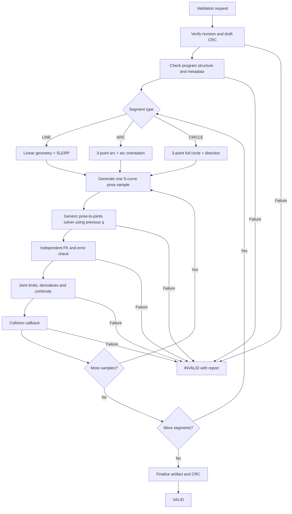

# STM32 Path Validation State — Fixed 1 ms CSP Artifact V4

This module consumes an immutable `TaughtProgram`, generates the timed joint
trajectory, validates it, writes compact CSP samples through an abstract storage
interface, and publishes `ValidatedTrajectory` metadata. It follows the
current MATLAB `SingleSegmentTest_*` pipelines. It dispatches every taught
segment to LINE, ARC, or CIRCLE geometry, then applies physical arc-length
limits, seven-phase jerk-limited S-curve timing, the matching quaternion
orientation rule, a generic pose-to-joints service, independent FK checking,
joint derivatives and limits.

## Actual state sequence



`PathValidation_Step()` processes a configurable number of samples per call,
so the supervisory task can yield between batches. One pose-solver callback
invocation is still bounded by the kinematics module's iteration limit.

## Ownership

| Data | Owner | Path Validation access |
|---|---|---|
| Frozen `TaughtProgram` | Program/Teaching manager | Read-only |
| Revision and draft CRC | Program manager | Verify |
| Validation phase/cursors/report | Path Validation | Read/write |
| S-curve configuration and thresholds | Commissioned configuration | Snapshot/read |
| Pose-to-joints solver, FK and robot model | Kinematics module | Callback |
| Environment collision model | Collision module | Callback |
| CSP sample stream | Program Store/external-memory driver | Write through callback |
| `ValidatedTrajectory` metadata | Path Validation until success; then Program Store | Write/publish |
| HMI progress/messages | HMI module | Receives report |
| Global faults/E-stop | Safety/Fault manager | Can cancel; never cleared here |

## Parameter ownership — no embedded placeholders

| Parameter | Source in final system |
|---|---|
| Segment TCP speed | Recorded segment/program recipe |
| TCP acceleration/jerk limits | Commissioned motion configuration |
| Sample period | Fixed contract: 1000 us |
| Joint position/velocity/acceleration limits | Final robot and drive configuration |
| FK error thresholds | Accuracy requirement plus numeric validation |
| Singularity threshold | Robot-specific offline sweep and commissioning |
| Maximum joint step | Continuity requirement, checked alongside velocity |
| Minimum segment length | Metrology/noise requirement |
| Storage capacity | Supplied by the future external-memory implementation |

## Joint-position representation

- IK, FK, collision checking and derivative calculations continue to use
  floating-point radians internally.
- Each stored execution sample contains six signed `int32_t` values matching
  the CiA 402 CSP Target Position object (`0x607A`).
- `drive_units_per_joint_rad[]`, `drive_zero_offset_units[]`, and
  `joint_direction_sign[]` are commissioned per axis. They must be derived from
  the selected drive configuration, electronic gearing, encoder scaling,
  mechanical gearbox and homing convention; they are not universal constants.
- Every IK result is quantized to drive units and converted back to radians
  before FK, limit, derivative and collision validation. The state therefore
  validates the command that will actually be sent, not only the unquantized IK
  result.

## Fixed 1 ms execution timing

`PV_SAMPLE_PERIOD_US` is fixed at 1000. Samples do not contain individual
timestamps: execution time is `sample_index * 1000 us`. Segment durations are
rounded upward to the next control tick and the exact segment endpoint is held
on that tick. Preview and Welding must transmit exactly one stored sample per
1 ms EtherCAT cycle.

## External-memory boundary

No flash IC or HAL driver is selected in this module. `PathValidationStorage`
provides `begin`, `write_sample`, `commit`, and `abort` callbacks plus the
available sample capacity. The current host test supplies a RAM backend. The
future STM32 backend should buffer 24-byte samples into flash pages and commit
the metadata/valid marker only after the payload CRC succeeds.

## Kinematics module

`robot_kinematics.c/.h` provides the state callbacks and keeps the kinematic
math outside `path_validation.c`:

- `RobotKinematics_Forward()` is the C translation of `controlFK.m`. It applies
  standard DH transforms for all six revolute joints and then multiplies the
  configured flange-to-TCP transform.
- `RobotKinematics_Jacobian()` is the C translation of `controlJacobian.m`. It
  returns the 6x6 base-frame geometric Jacobian in row-major order with
  `[linear velocity; angular velocity]` rows.
- `RobotKinematics_AdlsIk()` translates `ADLS_IK.m`, including the SO(3)
  logarithm orientation error, smallest-singular-value-based adaptive damping,
  scaled joint update and joint-limit clamping.
- `RobotKinematicsContext.selected_method` selects numerical ADLS or a future
  analytical solver. A true analytical solver can be connected through
  `analytical_solver` without editing Path Validation.

Despite its name containing "IK," `ADLS_IK.m` is not analytical IK. It is an
iterative numerical Adaptive Damped Least-Squares method. The module therefore
places it in `ROBOT_IK_NUMERICAL_ADLS`; the analytical slot remains explicit
and empty until a closed-form solver for the final arm geometry is developed.

The DH arrays, flange-to-TCP transform, joint limits and ADLS settings are
configuration data. The values in `robot_kinematics_test.c` are only a
UR5-scale verification fixture and must not become the production robot
configuration.

Do not copy `0.10 m/s`, `0.25 m/s²`, `1.0 m/s³`, `0.05 s`, UR5 limits, or
the current singularity threshold into production without deriving and documenting
them for the final arm, servo drives, gearbox ratios and welding process.

## Files

- `path_validation_types.h`: owned state, configuration, artifact, callbacks,
  result and report types.
- `path_validation.h`: public API.
- `path_validation.c`: LINE/ARC/CIRCLE geometry, S-curve/orientation generation,
  orchestration and checks.
- `path_validation_debug.h`: compile-time diagnostic logging.
- `path_validation_test.c`: host unit/integration test with mocked IK/FK and
  collision services.
- `path_validation_integration_example.c`: disabled STM32 task sketch.
- `robot_kinematics.h/.c`: FK, Jacobian, numerical ADLS IK, and Path Validation
  callback adapters.
- `robot_kinematics_test.c`: FK/Jacobian consistency and ADLS convergence test.

## Build the host test

```sh
cc -std=c11 -Wall -Wextra -Werror -pedantic \
  -DPV_DEBUG_ENABLE=1 \
  -I../teaching_state -I. \
  path_validation.c path_validation_test.c -lm -o path_validation_test
./path_validation_test
```

Build the kinematics test:

```sh
cc -std=c11 -Wall -Wextra -Werror -pedantic \
  -I../teaching_state -I. \
  robot_kinematics.c robot_kinematics_test.c -lm -o robot_kinematics_test
./robot_kinematics_test
```

## Important limitations

- LINE requires P1/P2. ARC requires start/mid/end. CIRCLE requires three
  non-collinear points plus CW/CCW direction.
- The state has no ADLS dependency. The generic pose-to-joints and FK callbacks
  must be connected to whichever embedded kinematics solver is finally chosen;
  the host test uses deterministic mocks.
- Collision checking must be supplied by the collision/environment module.
- ADLS is intended for offline Path Validation, not for the 1 ms CSP interrupt.
  Measure its worst-case execution time on the selected STM32 core and bound
  its iterations before commissioning.
- The second numerical derivative is sensitive to sample time and IK noise.
  Validate the embedded result against MATLAB reference vectors.
- Each stored sample is exactly 24 bytes: six signed 32-bit CSP target-position
  values. Cartesian pose, speed, velocity and acceleration are temporary
  validation data and are not retained.
- Segment boundaries and types remain in the metadata index table. Preview and
  Welding consume the immutable stored samples rather than regenerating IK.
- External storage writes remain outside the 1 ms execution interrupt. Preview
  and Welding should use DMA and RAM double buffering when the memory IC is
  selected.
- A passed software check is not a safety function and does not replace the
  safety controller, protective devices, safe commissioning or physical preview.

## Source mapping

- LINE: <https://github.com/Moallam456/Simulation-ControlGP/blob/main/Control/Trajectory/Pipeline/SingleSegmentTest_line.m>
- ARC: <https://github.com/Moallam456/Simulation-ControlGP/blob/main/Control/Trajectory/Pipeline/SingleSegmentTest_arc.m>
- CIRCLE: <https://github.com/Moallam456/Simulation-ControlGP/blob/main/Control/Trajectory/Pipeline/SingleSegmentTest_fullcircle.m>
- S-curve: <https://github.com/Moallam456/Simulation-ControlGP/blob/main/Control/Trajectory/TimeScaling/sCurveTimeScaling.m>
- FK: <https://github.com/Moallam456/Simulation-ControlGP/blob/main/Control/Kinematics/controlFK.m>
- Jacobian: <https://github.com/Moallam456/Simulation-ControlGP/blob/main/Control/Kinematics/controlJacobian.m>
- Numerical ADLS IK: <https://github.com/Moallam456/Simulation-ControlGP/blob/main/Control/Kinematics/IK/ADLS_IK.m>
